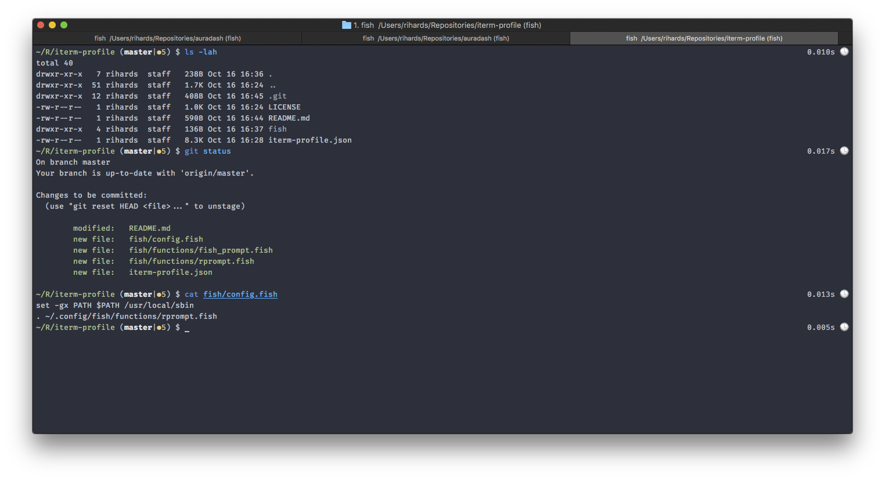

# iterm-profile
My current iTerm2 profile

# 

## Requirements

* [Iterm2](https://www.iterm2.com/)
* [fish shell](https://fishshell.com/)
* [FiraCode](https://github.com/tonsky/FiraCode)

## Installing

1. Download or clone this repository to a location of your choice
2. Edit `iterm-profile.json` changing USERNAME to your terminal username
3. In Iterm2's preferences under General tab there's an option called `Load preferences from a custom folder or URL` use that to select the directory where `iterm-profile.json` resides
4. (Optional) Update your `config.fish` and `functions` fish files with the provided ones under `~/.config/fish/`
